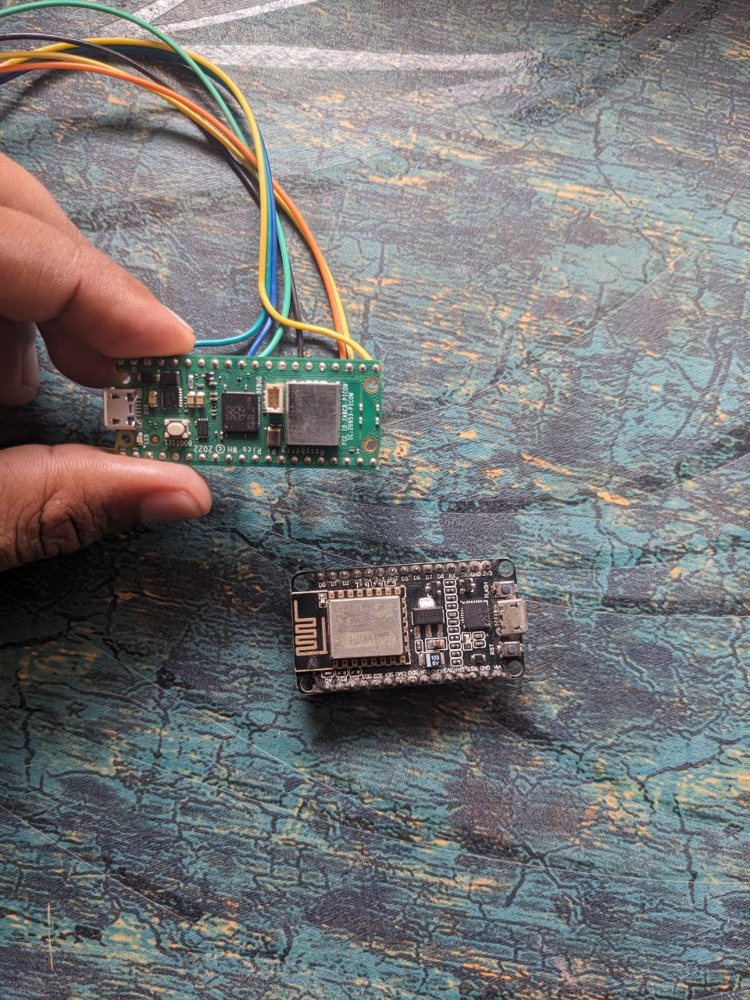
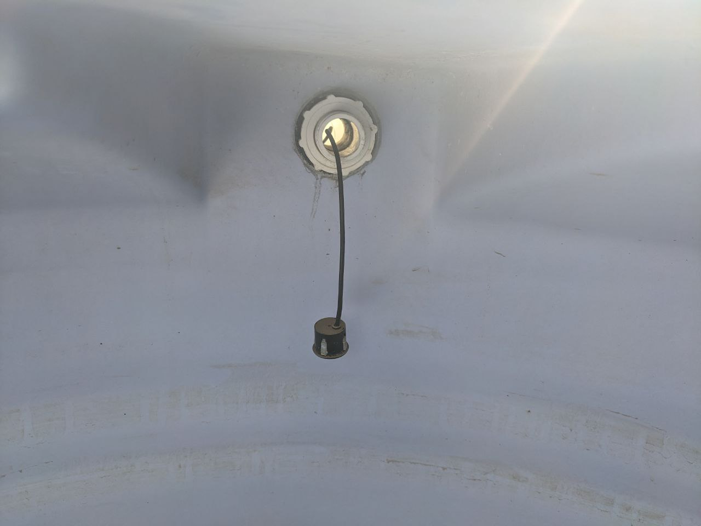
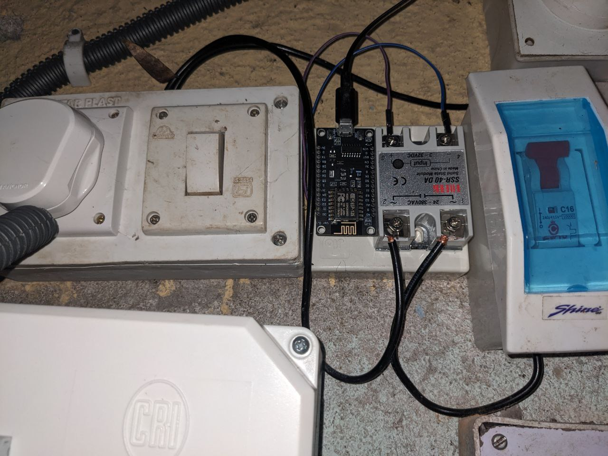
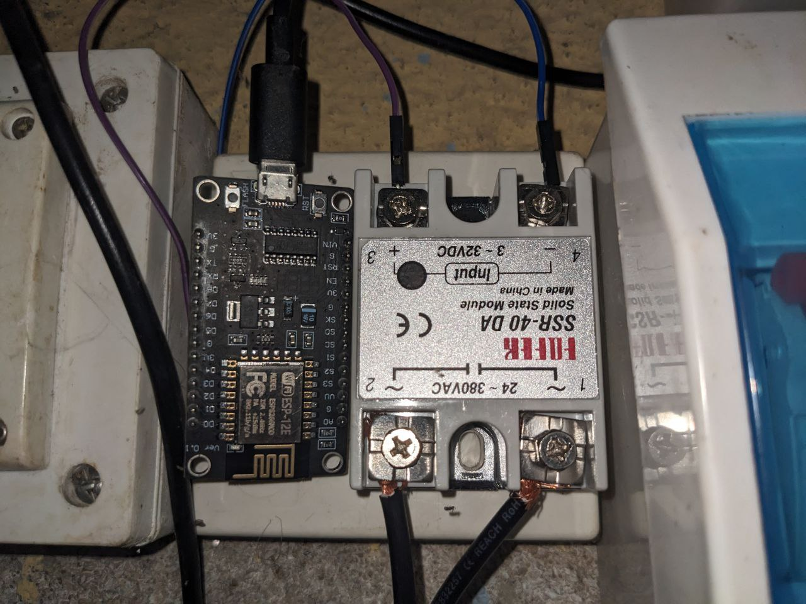
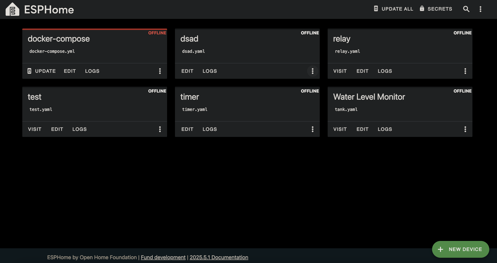
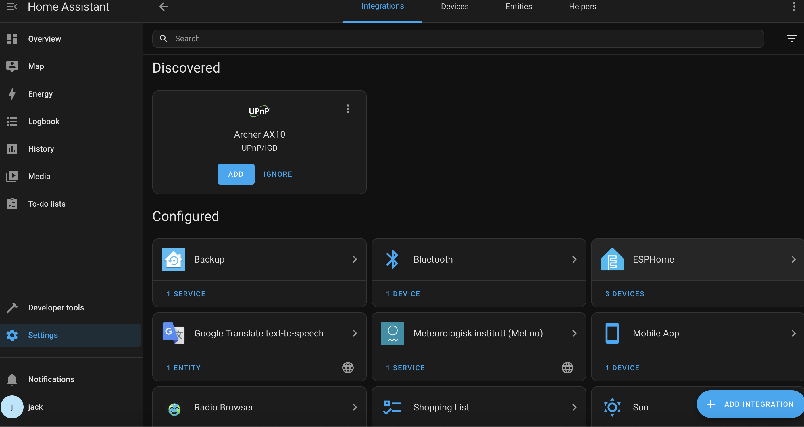
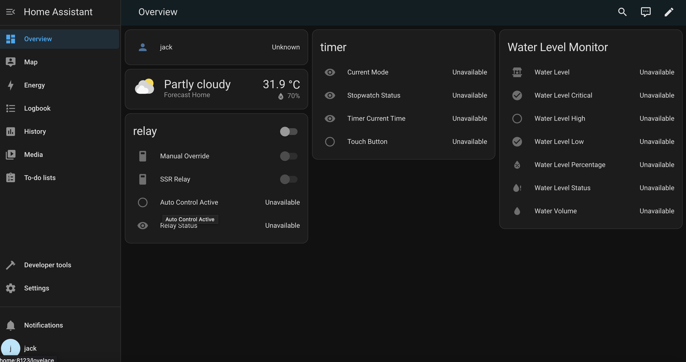

# Wi-Fi Based Water Pump Automation

Transform your ordinary water pump into a smart, Wi-Fi-enabled system! This project leverages the **ESP8266**, a **waterproof ultrasonic sensor**, and an **SSR-40DA** to automate tank filling, prevent overflow, save water, and enable real-time monitoring and control via **Home Assistant**.

---

## 🌟 Features
- **Automated Tank Filling**: Automatically turns the pump on/off based on water levels.
- **Overflow Prevention**: Stops the pump when the tank is full.
- **Real-Time Monitoring**: Track water level, volume, and pump status via Home Assistant.
- **Manual Override**: Control the pump manually for testing or emergencies.
- **Wi-Fi Connectivity**: Remote access and control using ESPHome and Home Assistant.
- **Customizable**: Easily adjust tank dimensions, thresholds, and logic to suit your needs.

---

## 🛠️ Hardware Requirements
1. **ESP8266 (NodeMCU/LoLin)** - Quantity: 2
2. **Waterproof Ultrasonic Sensor** (e.g., HC-SR04P)
3. **Solid State Relay (SSR-40DA)**
4. **Power Supply** - 5V Battery or Adapter
5. **Wires, Connectors, and Optional MCB** (for safety)

---

## 📷 Project Setup Images
<p align="center">
  
  
  
  
  
  
  
  
</p>

---

## ⚙️ Software Setup
Before diving into hardware, set up the following software components:

### 1. Install Docker
- Ensure **Docker** is installed on your system.
- If not installed, follow the [Docker Installation Guide](https://docs.docker.com/engine/install/).

### 2. Install ESPHome
- Use the following `docker-compose.yml` to set up ESPHome:
```yaml
services:
  esphome:
    image: ghcr.io/imagegenius/esphome:latest
    container_name: esphome
    environment:
      - PUID=1000
      - PGID=1000
      - TZ=Etc/UTC
      - ESPHOME_DASHBOARD_USE_PING=false # optional
    volumes:
      - /path/to/esphome/config:/config
    ports:
      - 6052:6052
    restart: unless-stopped
```
- Replace `/path/to/esphome/config` with your desired configuration path.
- Save the file as `docker-compose.yml`.
- Run `docker compose up -d` in the terminal (in the same folder).
- Access ESPHome at [http://localhost:6052](http://localhost:6052) or `http://<your-ip>:6052` for remote devices.

### 3. (Optional) Install Home Assistant
- Use the following `docker-compose.yml` for Home Assistant:
```yaml
services:
  homeassistant:
    container_name: homeassistant
    image: "ghcr.io/home-assistant/home-assistant:stable"
    volumes:
      - ./conf:/config
      - ./templates:/config/custom_templates
      - /etc/localtime:/etc/localtime:ro
    restart: unless-stopped
    healthcheck:
      test: ["CMD", "curl", "-f", "http://localhost:8123"]
      interval: 1m
      timeout: 10s
      retries: 3
      start_period: 40s
    ports:
      - 8123:8123
    privileged: true
```
- Ensure the `conf` and `templates` directories exist.
- Run `docker compose up -d` in the terminal.
- Access Home Assistant at `http://localhost:8123` and complete the setup.

---

## 🔧 Hardware Setup Instructions

### Step 1: Configure the Relay ESP8266
1. Connect the first **ESP8266** to your computer via USB.
2. Open the ESPHome dashboard (`http://localhost:6052`).
3. Click **Secrets** (top-right) and add:
```yaml
wifi_ssid: "YOUR_WIFI_NAME_HERE"
wifi_password: "YOUR_WIFI_PASSWORD_HERE"
api_key: "YOUR_HOMEASSISTANT_API_KEY" # optional
```
4. Click **+ New Device**, name it (e.g., `relay`), select **NodeMCU v2**, and save.
5. Edit the generated `.yaml` file with the following:
```yaml
esphome:
  name: relay
  friendly_name: Relay

esp8266:
  board: nodemcuv2

logger:
  level: DEBUG

api:
  encryption:
    key: !secret api_key

ota:
  platform: esphome
  password: "dbddea81b8ffd0267fe9d781f42c625b"

wifi:
  ssid: !secret wifi_ssid
  password: !secret wifi_password
  manual_ip:
    static_ip: 192.168.0.101
    gateway: 192.168.0.1
    subnet: 255.255.255.0
  ap:
    ssid: "Relay Fallback Hotspot"
    password: "gXBx50azyVMz"

web_server:
  port: 80

captive_portal:

status_led:
  pin:
    number: D4
    inverted: true

switch:
  - platform: gpio
    pin: D2
    name: "SSR Relay"
    id: ssr_relay
    restore_mode: RESTORE_DEFAULT_OFF
    on_turn_on:
      then:
        - logger.log: "Pump turned ON by water level control"
        - globals.set:
            id: relay_state
            value: 'true'
    on_turn_off:
      then:
        - logger.log: "Pump turned OFF by water level control"
        - globals.set:
            id: relay_state
            value: 'false'

  - platform: template
    name: "Manual Override"
    id: manual_override
    restore_mode: RESTORE_DEFAULT_OFF
    turn_on_action:
      - logger.log: "Manual override enabled - pump control disabled"
      - globals.set:
          id: manual_mode
          value: 'true'
    turn_off_action:
      - logger.log: "Manual override disabled - automatic control resumed"
      - globals.set:
          id: manual_mode
          value: 'false'

  - platform: restart
    name: "Restart"

globals:
  - id: relay_state
    type: bool
    restore_value: true
    initial_value: 'false'
  - id: manual_mode
    type: bool
    restore_value: true
    initial_value: 'false'

binary_sensor:
  - platform: status
    name: "Status"
  - platform: template
    name: "Auto Control Active"
    id: auto_control_active
    lambda: |-
      return !id(manual_mode);

text_sensor:
  - platform: template
    name: "Relay Status"
    id: relay_status
    lambda: |-
      if (id(manual_mode)) {
        return {"Manual Mode"};
      } else if (id(relay_state)) {
        return {"Auto - Pump ON"};
      } else {
        return {"Auto - Pump OFF"};
      }
    update_interval: 5s
  - platform: version
    name: "ESPHome Version"
    hide_timestamp: true
  - platform: wifi_info
    ip_address:
      name: "IP Address"
    ssid:
      name: "Connected SSID"

sensor:
  - platform: wifi_signal
    name: "WiFi Signal"
    update_interval: 60s
  - platform: uptime
    name: "Uptime"
    filters:
      - lambda: return x / 3600;
    unit_of_measurement: "h"
    accuracy_decimals: 1

interval:
  - interval: 60s
    then:
      - logger.log: 
          format: "Relay Status: %s - Manual Mode: %s"
          args: [ 'id(relay_state) ? "ON" : "OFF"', 'id(manual_mode) ? "ENABLED" : "DISABLED"' ]
```
6. Click **Install**, select **Plug into this computer**, and wait for the firmware to flash.
7. Disconnect the ESP8266 after flashing.

### Step 2: Wire the Relay ESP8266
- **GPIO Connections**:
```
┌───────────────┐
│   NodeMCU     │
│ (ESP8266)     │
│               │
│  D4 (GPIO2) ──> Onboard LED (Status)  
│  D2 (GPIO4) ──> SSR Relay (Control Pin)  
│  GND ─────────> SSR Relay GND  
│  3V3/5V ──────> SSR Relay VCC  
└───────────────┘

┌───────────────┐
│   SSR Relay   │
│               │
│ Input: VCC, GND, IN (from D2)  
│ Output: AC Live (Pump control)  
└───────────────┘
```
- **Safety Note**: Consult an electrician for AC wiring. Use an MCB for safety.
- Test the setup using an LED or mobile charger via the web interface (`http://192.168.0.101`).
- For detailed wiring, watch [this YouTube video](https://youtu.be/DZrOOhRCtZM) (uses Arduino, but adapt for ESP8266).

### Step 3: Configure the Water Level ESP8266
1. Connect the second **ESP8266** to your computer.
2. Follow the same steps in ESPHome to create a new device (e.g., `nodemcu-water-level`).
3. Edit the `.yaml` file with:
```yaml
esphome:
  name: nodemcu-water-level
  friendly_name: Water Level Monitor

esp8266:
  board: nodemcuv2

logger:
  level: DEBUG

wifi:
  ssid: !secret wifi_ssid
  password: !secret wifi_password
  manual_ip:
    static_ip: 192.168.0.100
    gateway: 192.168.0.1
    subnet: 255.255.255.0
  ap:
    ssid: "Water-Level-Fallback"
    password: "your-fallback-password"

ota:
  platform: esphome
  password: "4980cd8a80a1188c42856fd3c3d1ac45"

api:
  encryption:
    key: !secret api_key

web_server:
  port: 80

http_request:
  useragent: esphome/device
  timeout: 10s
  verify_ssl: false

status_led:
  pin:
    number: D4
    inverted: true

sensor:
  - platform: ultrasonic
    trigger_pin:
      number: D5
      inverted: true
    echo_pin: D6
    name: "Water Distance Raw"
    id: water_distance_sensor
    update_interval: 2s
    timeout: 4m
    pulse_time: 10us
    internal: true
    filters:
      - filter_out: nan
      - median:
          window_size: 5
          send_every: 3
      - lambda: |-
          if (x > 3.0) {
            return {};
          }
          return x;

  - platform: template
    name: "Water Level"
    id: water_level
    unit_of_measurement: "m"
    device_class: distance
    state_class: measurement
    accuracy_decimals: 2
    icon: "mdi:water-well"
    lambda: |-
      float tank_height = 1.5;
      float sensor_offset = 0.3;
      float max_water_height = 1.2;
      float sensor_distance = id(water_distance_sensor).state;
      
      if (isnan(sensor_distance)) {
        return {};
      }
      
      float water_level = max_water_height - sensor_distance;
      
      if (water_level < 0) water_level = 0;
      if (water_level > max_water_height) water_level = max_water_height;
      
      return water_level;
    update_interval: 2s

  - platform: template
    name: "Water Level Percentage"
    id: water_level_percentage
    unit_of_measurement: "%"
    state_class: measurement
    accuracy_decimals: 1
    icon: "mdi:water-percent"
    lambda: |-
      float tank_height = 1.5;
      float sensor_offset = 0.3;
      float max_water_height = 1.2;
      float sensor_distance = id(water_distance_sensor).state;
      
      if (isnan(sensor_distance)) {
        return {};
      }
      
      float water_level = max_water_height - sensor_distance;
      
      if (water_level < 0) water_level = 0;
      if (water_level > max_water_height) water_level = max_water_height;
      
      return (water_level / max_water_height) * 100;
    update_interval: 2s
    on_value:
      then:
        - script.execute: control_pump

  - platform: template
    name: "Water Volume"
    id: water_volume
    unit_of_measurement: "L"
    state_class: measurement
    accuracy_decimals: 0
    icon: "mdi:water"
    lambda: |-
      float tank_height = 1.5;
      float sensor_offset = 0.3;
      float max_water_height = 1.2;
      float tank_radius = 0.5;
      float pi = 3.14159;
      float sensor_distance = id(water_distance_sensor).state;
      
      if (isnan(sensor_distance)) {
        return {};
      }
      
      float water_level = max_water_height - sensor_distance;
      
      if (water_level < 0) water_level = 0;
      if (water_level > max_water_height) water_level = max_water_height;
      
      float volume_m3 = pi * tank_radius * tank_radius * water_level;
      return volume_m3 * 1000;
    update_interval: 2s

  - platform: wifi_signal
    name: "WiFi Signal"
    update_interval: 60s

  - platform: uptime
    name: "Uptime"
    filters:
      - lambda: return x / 3600;
    unit_of_measurement: "h"
    accuracy_decimals: 1

binary_sensor:
  - platform: template
    name: "Water Level Low"
    id: water_low
    device_class: problem
    lambda: |-
      return id(water_level_percentage).state < 35;

  - platform: template
    name: "Water Level Critical"
    id: water_critical
    device_class: problem
    lambda: |-
      return id(water_level_percentage).state < 20;

  - platform: template
    name: "Water Level High"
    id: water_high
    lambda: |-
      return id(water_level_percentage).state > 90;

  - platform: status
    name: "Status"

text_sensor:
  - platform: template
    name: "Water Level Status"
    id: water_level_status
    icon: "mdi:water-alert"
    lambda: |-
      float percentage = id(water_level_percentage).state;
      if (isnan(percentage)) {
        return {"Unknown"};
      } else if (percentage < 20) {
        return {"Critical"};
      } else if (percentage < 35) {
        return {"Low"};
      } else if (percentage < 80) {
        return {"Normal"};
      } else {
        return {"High"};
      }
    update_interval: 5s

  - platform: version
    name: "ESPHome Version"
    hide_timestamp: true

  - platform: wifi_info
    ip_address:
      name: "IP Address"
    ssid:
      name: "Connected SSID"

switch:
  - platform: restart
    name: "Restart"

globals:
  - id: pump_state
    type: bool
    restore_value: true
    initial_value: 'false'

script:
  - id: control_pump
    then:
      - lambda: |-
          float water_percentage = id(water_level_percentage).state;
          bool current_pump_state = id(pump_state);
          
          if (isnan(water_percentage)) {
            ESP_LOGW("pump_control", "Water level reading is NaN, skipping control");
            return;
          }
          
          ESP_LOGI("pump_control", "Water level: %.1f%%, Current pump state: %s", 
                   water_percentage, current_pump_state ? "ON" : "OFF");
      - if:
          condition:
            lambda: |-
              float water_percentage = id(water_level_percentage).state;
              bool current_pump_state = id(pump_state);
              return (water_percentage <= 30.0 && !current_pump_state);
          then:
            - lambda: |-
                ESP_LOGI("pump_control", "Water level low (%.1f%%), turning pump ON", id(water_level_percentage).state);
                id(pump_state) = true;
            - http_request.post:
                url: "http://192.168.0.101/switch/ssr_relay/turn_on"
                request_headers:
                  Content-Type: application/json
                on_response:
                  then:
                    - lambda: |-
                        ESP_LOGI("pump_control", "HTTP Response: %d", response->status_code);
                        if (response->status_code == 200) {
                          ESP_LOGI("pump_control", "Successfully turned pump ON");
                        } else {
                          ESP_LOGI("pump_control", "Failed to turn pump ON");
                        }
      - if:
          condition:
            lambda: |-
              float water_percentage = id(water_level_percentage).state;
              bool current_pump_state = id(pump_state);
              return (water_percentage >= 80.0 && current_pump_state);
          then:
            - lambda: |-
                ESP_LOGI("pump_control", "Water level high (%.1f%%), turning pump OFF", id(water_level_percentage).state);
                id(pump_state) = false;
            - http_request.post:
                url: "http://192.168.0.101/switch/ssr_relay/turn_off"
                request_headers:
                  Content-Type: application/json
                on_response:
                  then:
                    - lambda: |-
                        ESP_LOGI("pump_control", "HTTP Response: %d", response->status_code);
                        if (response->status_code == 200) {
                          ESP_LOGI("pump_control", "Successfully turned pump OFF");
                        } else {
                          ESP_LOGI("pump_control", "Failed to turn pump OFF");
                        }

interval:
  - interval: 30s
    then:
      - logger.log: 
          format: "Water Level: %.2fm (%.1f%%) - Status: %s - Pump: %s"
          args: [ 'id(water_level).state', 'id(water_level_percentage).state', 'id(water_level_status).state.c_str()', 'id(pump_state) ? "ON" : "OFF"' ]
```
4. Click **Install**, select **Plug into this computer**, and wait for the firmware to flash.
5. Access the web interface at `http://192.168.0.100`.

### Step 4: Wire the Water Level ESP8266
- **GPIO Connections**:
```
┌───────────────┐          ┌───────────────┐
│   NodeMCU     │          │   Ultrasonic  │
│ (ESP8266)     │          │   (HC-SR04)   │
│               │          │               │
│ D5 (GPIO14) ──> Trigger  │               │
│ D6 (GPIO12) <── Echo    ─│               │
│ 3.3V/5V ──────> VCC      │               │
│ GND ──────────> GND      │               │
└───────────────┘          └───────────────┘

┌───────────────┐
│   SSR Relay   │
│               │
│ IN  <── D2 (GPIO4) │
│ VCC <── 3.3V/5V   │
│ GND <── GND       │
│ AC Load ──> Pump  │
└───────────────┘
```

---

## 🔹 Customization Parameters
Adjust the following based on your setup:

### 1. Tank Dimensions & Sensor Mounting
- `tank_height`: Total tank height (e.g., `1.5m`).
- `sensor_offset`: Distance from tank top to sensor (e.g., `0.3m`).
- `max_water_height`: Usable water depth (`tank_height - sensor_offset`).

**Example**: For a 2m tall tank with the sensor 20cm from the top:
  - `tank_height = 2.0`
  - `sensor_offset = 0.2`
  - `max_water_height = 1.8`

### 2. Tank Shape for Volume Calculation
- **Cylindrical Tank**: Use `π × r² × h` (default in YAML).
- **Rectangular Tank**: Modify to `length × width × height`.
- Update the `water_volume` sensor in the YAML accordingly.

### 3. Pump Control Thresholds
- **Pump ON**: ≤ 30% water level.
- **Pump OFF**: ≥ 80% water level.
- Adjust these in the `control_pump` script based on your tank capacity and usage.

### 4. Relay Wiring
- Choose **Normally Open (NO)** or **Normally Closed (NC)** based on safety preferences.
- Ensure AC wiring complies with **local electrical standards**.

### 5. Network Configuration
- Update the `manual_ip` (e.g., `192.168.0.100` for water level, `192.168.0.101` for relay).
- If both relay and sensor are on the same ESP8266, remove HTTP requests and control the relay directly using `id(ssr_relay)`.

---

## ⚠️ Safety Notes
- **Electrical Safety**: Always consult a professional electrician for AC wiring and pump connections.
- **MCB Usage**: Use a Miniature Circuit Breaker for added safety.
- **Waterproofing**: Ensure the ultrasonic sensor is properly sealed for outdoor use.
- **Testing**: Verify connections with low-voltage devices (e.g., LEDs) before connecting to the pump.

---

## 📚 Resources
- [ESPHome Documentation](https://esphome.io)
- [Home Assistant Installation Guide](https://www.home-assistant.io/installation/linux)
- [Wiring Reference Video](https://youtu.be/DZrOOhRCtZM) (adapt for ESP8266)

---

## 🚀 Next Steps
1. Integrate with Home Assistant for advanced automations and notifications.
2. Add alerts for low/critical water levels via Home Assistant.
3. Explore ESPHome's web server for real-time debugging and control.

---

**Happy Automating!** 💧